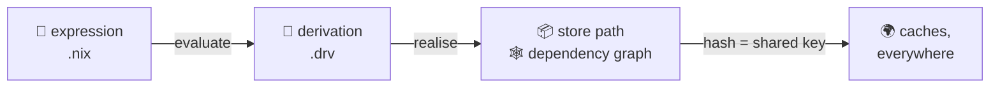
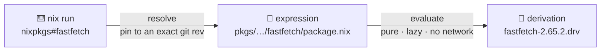
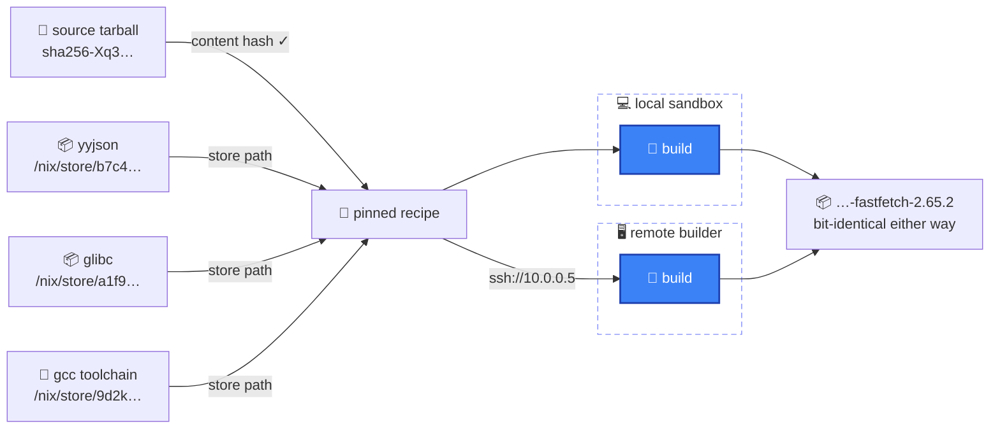
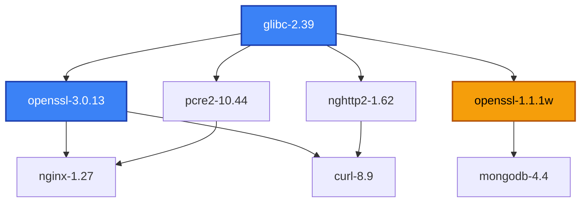
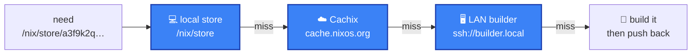

<SectionBookend image="/alice-under-the-hood.png" title="Under the hood" subtitle="what actually happens when you run a command" />

---

# `nix run nixpkgs#fastfetch` — the whole trip

<div class="grid grid-cols-2 gap-8 pr-40 text-xs text-left">
<div>

**📜 what you write**

```nix
mkDerivation {
  pname = "fastfetch";
  src = fetchFromGitHub { … };
}
```

<div class="text-center text-2xl opacity-40 leading-none pt-1">↓</div>

</div>
<div>

**📦 what lands on disk**

```text
/nix/store/a3f9k2q…-fastfetch-2.65.2/
└── bin/fastfetch
```

<div class="text-center text-2xl opacity-40 leading-none pt-1">↓</div>

</div>
</div>

<div class="flex justify-center pt-2">



</div>

<div class="grid grid-cols-2 gap-8 pl-40 pt-2 text-xs text-left">
<div>

<div class="text-center text-2xl opacity-40 leading-none pb-1">↑</div>

**🧾 what it evaluates to**

```json
{ "name": "fastfetch-2.65.2",
  "inputDrvs": [ "…-yyjson.drv" ],
  "builder": "…/bin/bash" }
```

</div>
<div>

<div class="text-center text-2xl opacity-40 leading-none pb-1">↑</div>

**🌍 what gets shared**

```text
GET cache.nixos.org/a3f9k2q….narinfo
→ 200 — download, don't rebuild
```

</div>
</div>

<!--
One command anchors this whole section. This map is the overview — each arrow is one stop, and the following slides zoom into each stop in order (the realise stop gets a bonus zoom into the sandbox). Keep pointing back to this picture as we go.

The trip: the flake reference resolves to a Nix **expression**; evaluating it produces a **derivation** (a pure build recipe); **realising** the derivation produces an immutable **store path**; store paths reference each other, forming a **dependency graph**; and because every path is named by the hash of its inputs, that graph can be **shared** with any machine on earth.

Punchline at the end of the trip: nothing is "installed". No PATH change, no profile entry — Nix just execs `/nix/store/…-fastfetch-2.65.2/bin/fastfetch` straight out of the store.
-->

---

<PipelineSteps :current="1" />

<div class="flex justify-center items-center h-[360px]">



</div>

<div class="text-center opacity-70">evaluation is a <b>pure function</b>: pinned inputs in → build recipe out · <b>nothing is built or downloaded yet</b></div>

<!--
**Resolve** — `nixpkgs#fastfetch` looks up `nixpkgs` in the flake registry (→ `github:NixOS/nixpkgs`) and pins it to an exact git revision, recorded in the lock.

**Evaluate** — the Nix expression runs as a pure, lazy function: no network, no mutation, no ambient state. Its result is not a binary — it's a **derivation**, `…-fastfetch-2.65.2.drv`: the complete build recipe plus the hash of every input (sources, dependencies, flags, compiler).

Mental model: evaluation is a pure function from pinned inputs to a recipe. Nothing has been built or downloaded yet — that's the next stop.
-->

---

<PipelineSteps :current="2" />

<div class="flex justify-center items-center h-[360px]">


</div>

<div class="text-center opacity-70">realising makes the recipe <b>real</b> — cheapest way first: reuse ✅ → download ⬇️ → build 🔨</div>

<!--
Realising = turning the recipe into a real store path, cheapest way first: already in the store → done; prebuilt in a binary cache → download ("substitute"); otherwise → build it, in a sealed sandbox.

The clean room, in three bullets: 🚫🌐 no network · 📦 declared inputs only, mounted read-only · 🕳️ sealed namespaces.

The sandbox is a clean room: a build can't `curl` or `pip install` — every input must be declared up front. Only declared inputs are mounted, read-only: no `/home`, no system libs, no ambient state. Private mount / PID / net namespaces, pinned build user, fixed timestamps.

Same inputs → same output. The sealed environment is *why* the hash can promise reproducibility.

And Nix realises the whole **closure** this way — `pcre2 → gcc-libs → glibc` — before anything runs.
-->

---

<PipelineSteps :current="3" />

<div class="flex justify-center items-center h-[360px]">



</div>

<div class="text-center opacity-70">the only door into the clean room is a <b>hash</b> — sources by content hash, dependencies by store path</div>

<div class="text-center opacity-60 text-sm pt-2">every input is pinned, so <b>either room</b> yields the same bytes — build wherever is fastest: <code>--builders "ssh://10.0.0.5"</code></div>

<!--
Zooming into the "build in sandbox" node from the previous slide. The room is sealed — the *only* door in is a hash, and there are two kinds:

**Sources — by content hash.** `fetchurl` / `fetchFromGitHub` are *fixed-output derivations*: the one place network access is allowed, precisely because the output must match a `sha256` declared up front. Fetch from the original mirror, a CDN, a cache — doesn't matter *where* the bytes come from; if they don't hash to the declared value, the build fails. Identity lives in the hash, not the URL.

**Dependencies — by store path.** yyjson, glibc, even the gcc toolchain itself are already-realised store paths (named by *their* input hashes), mounted read-only. No `/usr/lib`, no `$PATH` from your shell — if it isn't declared, it doesn't exist in there.

That's the whole trick: every input is pinned by hash, so the sandbox can pull each one from wherever is cheapest — local store, binary cache, upstream mirror — and the result is byte-identical either way. Same inputs → same output, now enforceable.

**Remote builds.** Because the recipe + inputs are fully pinned, the sandbox doesn't have to be on this machine: `nix build --builders "ssh://user@10.0.0.5"` ships the derivation to any machine you can reach (or `nix.buildMachines` in the config), it builds in *its* sandbox, and the store path comes back — bit-identical to a local build. Laptops delegate to the beefy desktop; CI farms work the same way.
-->

---

<PipelineSteps :current="4" />

<div class="pt-6"></div>

<div class="grid grid-cols-2 gap-10 text-left">
<div>

### 🗄️ FHS — every other distro

```text
/usr/bin/python3         # THE python
/usr/lib/libssl.so       # THE openssl
/etc/nginx/nginx.conf    # THE config
```

one global namespace · one version of each thing · every install **overwrites in place**

</div>
<div>

### ❄️ the store

```text
/nix/store/a3f9…-python3-3.12.8/bin/python3
/nix/store/b7c4…-openssl-3.0.13/lib/libssl.so
/nix/store/c1x8…-openssl-1.1.1w/lib/libssl.so
```

every package **self-contained** · addressed by hash · nothing is ever overwritten

</div>
</div>

<div class="text-center opacity-70 pt-8">Nix deliberately breaks the <b>FHS</b> — "which version?" is answered <b>per-app</b> (baked-in store paths), not per-machine</div>

<div class="text-center opacity-60 text-sm pt-2">the catch: pre-built binaries that <em>assume</em> <code>/usr/lib</code> exists need a shim — <code>nix-ld</code>, in NixMaxxing</div>

<!--
The FHS — Filesystem Hierarchy Standard — is what every conventional distro follows: /usr/bin, /usr/lib, /etc as THE well-known locations. It's a *convention of global mutable state*: one namespace, one version of each library, and installing anything means overwriting what's there. It's exactly the "traditional way" slide from earlier, standardized.

Nix opts out on purpose. On NixOS there is no populated /usr/lib at all (just /usr/bin/env and /bin/sh for scripts). Every package lives in its own hash-addressed prefix, and binaries find their exact dependencies via RPATH entries and patched shebangs that point at absolute store paths — which is *how* two OpenSSLs can coexist — you'll see exactly that in the dependency graph on the next slide: nothing ever looks anything up in a shared directory.

Trade-off to be honest about: software distributed as pre-built FHS-assuming binaries (Steam games, random vendor tools, Claude Code) can't find their loader or libs. The escape hatches — nix-ld, buildFHSEnv, steam-run — come up in NixMaxxing.
-->

---


<PipelineSteps :current="4" />

<div class="flex flex-col items-center justify-center h-[440px]">



</div>

<!--
The **hash** is computed over *every* build input — sources, deps, flags, compiler. The name-version part is just a human-friendly label. Each path is **immutable** and self-contained, so many versions of anything coexist with zero conflicts — there is no global `/usr/lib` to fight over.

**Two kinds of hash, one store.** The default is **input-addressed**: the path is the hash of the *recipe*, so it's known before the build even starts. The opt-in alternative (`ca-derivations`, still experimental) is **content-addressed**: the path is the hash of the *output bytes*, known only after building — which lets a rebuilt-but-bit-identical output keep its path, so dependents don't rebuild. Deep dive later in NixMaxxing ("Two doors, one store").

**The store is a graph.** Each path records which store paths it references — that's a **DAG**. Arrows flow *down from glibc*: every arrow means "is an input to" — inputs feed into whatever is built from them. The bullets to deliver:

- **Directed** — every arrow means "is an input to" · **acyclic** — nothing can depend on itself, even indirectly (a cycle would mean "build A before A")
- So a valid **build order** always exists — start at the inputs — and independent branches build **in parallel**
- Shared nodes are built & stored **once**: installing curl next to nginx only builds the **delta** (nghttp2), never openssl or glibc again
- Nothing points at a path anymore → safe to **garbage-collect**
- Exact **closures** — follow the arrows and you have the complete, exact dependency set

**Two OpenSSLs (amber).** mongodb 4.4 wants openssl 1.1 while nginx and curl are on 3.0 — on a normal distro that's dependency hell: one `/usr/lib/libssl.so` to fight over. Here each version is its own store path (the version is part of the hashed inputs), so both live side by side and every app links against exactly the one it declared. This is the "no dependency hell" slide from later, already visible in the store's anatomy.

**And it's shared.** nginx and curl both stand on openssl → glibc — those are the *same* store paths, built once, stored once, cached once. Install curl next to nginx and only its *unique* node (nghttp2) gets built; you pay for the **delta**, not the whole tree. Change one input anywhere → new hash → everything *downstream of it* becomes a different path and rebuilds.
-->

---

<PipelineSteps :current="5" />

<div class="flex justify-center items-center h-[360px]">



</div>

<div class="text-center opacity-70">the hash is a <b>global key</b>, so a store can live at <b>any level</b> — this machine, your LAN, the planet — and the nearest copy wins</div>

<!--
A store path's name **is** the hash of its inputs — so every machine on earth agrees on what a build *should* be. That hash is the shared key that makes global caching work at all.

The diagram is a **cache hierarchy**, like CPU caches: the *same* store, replicated at different distances. First the **local store** (already on disk — free). Then the **caches** — Cachix or cache.nixos.org: someone already built it, just download. Only if it's cached *nowhere* does anyone build — and even then, preferably not here: a **LAN builder** (`ssh://builder.local`) takes the recipe and does the work, its store served over SSH. Whoever builds *pushes back*, warming the caches for everyone behind you.

Substituting means downloading instead of rebuilding. You never trust the *server* — you trust the hash plus signatures.

**Cachix** — hosted binary caches: push once and the whole community can substitute your builds; public caches serve millions of paths.

**IPFS** — Nix paths are *already* content-addressed, so they map straight onto a content-addressed peer-to-peer network: share builds forever, with no single point of failure.

End of the trip: from one `.nix` expression to a build the whole planet can reuse.
-->
