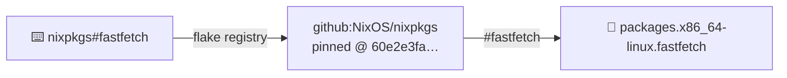
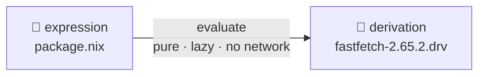
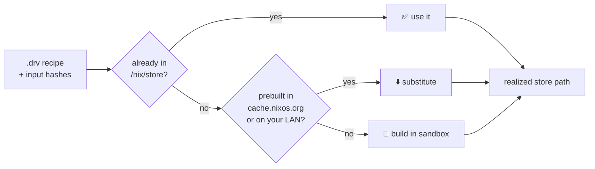
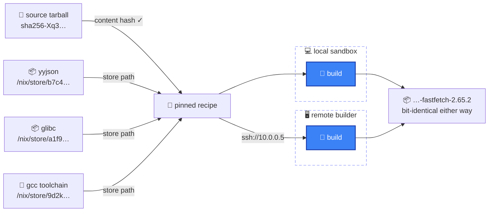
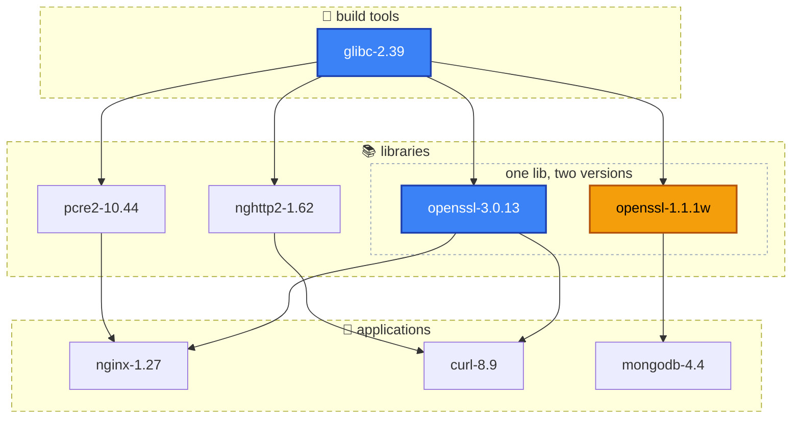
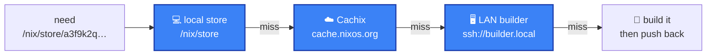

<SectionBookend image="/alice-under-the-hood.png" title="Under the hood" subtitle="what actually happens when you run a command" />

---

# A flake ≈ `package.json` — for anything Nix builds

> _If you've used npm, you already know the shape of this_

<div class="grid grid-cols-2 gap-8 mt-2">
<div>

### <Ico name="package" /> Node

```json
// package.json — what you want
{
  "dependencies": { "left-pad": "^1.3.0" }
}
```

```json
// package-lock.json — what you got, exactly
{
  "node_modules/left-pad": {
    "version": "1.3.0",
    "integrity": "sha512-mqcy0Xh4…"
  }
}
```

</div>
<div>

### <Ico name="snowflake" /> Nix

```nix
# flake.nix — what you want
{
  inputs.left-pad.url = "github:acme/left-pad";
  outputs = { left-pad, ... }: { /* … */ };
}
```

```json
// flake.lock — what you got, exactly
{
  "left-pad": {
    "rev": "60e2e3fa…",
    "narHash": "sha256-i8yYPMdb…"
  }
}
```

</div>
</div>

<div class="opacity-60 text-sm pt-2">Same idea, bigger reach: the same lockfile discipline scales from <b>one dev shell</b> all the way up to <b>a whole NixOS machine</b> — not just one language's libraries.</div>

<div class="opacity-60 text-sm pt-1">…and one level deeper: both hashes above only pin what you <b>download</b> — Nix <em>also</em> names every <b>build result</b> by hash. That's the next few slides <Ico name="arrow-right" /></div>

<!--
Land the analogy first — package.json : package-lock.json :: flake.nix : flake.lock, "what you want" vs "what you got, exactly". If the room knows npm, this is free intuition.

Then plant the flag on where the analogy *ends*, because it matters for everything that follows: npm's `integrity` and flake.lock's `narHash` are the same kind of thing — a **content hash of a downloaded artifact**. It verifies what you fetched, and npm stops there: everything that happens *after* the fetch — the node_modules layout, native addon compiles, postinstall scripts — has no hash, no name, no identity. Two machines with identical lockfiles can still end up with different results.

Nix keeps going: evaluation derives a hash-address for every **build result** — computed from the recipe *before the build even runs* (that's "input-addressed"; the evaluate stop coming up shows it in the .drv). So the lockfile discipline doesn't end at the download — the *outputs* are named, verifiable, cacheable, and shareable too. npm pins the shopping list; Nix pins the shopping list *and* names every dish before it's cooked.
-->

---

# `nix run nixpkgs#fastfetch` — the whole trip

<PipelineSteps />

<div class="flex justify-center items-center h-[340px]">
<div class="relative w-[860px] h-[200px] text-sm">
  <svg class="absolute inset-0 w-full h-full" viewBox="0 0 860 200" fill="none">
    <defs>
      <marker id="trip-arrow" viewBox="0 0 10 10" refX="8" refY="5" markerWidth="7" markerHeight="7" orient="auto-start-reverse">
        <path d="M 0 0 L 10 5 L 0 10 z" fill="#94a3b8" />
      </marker>
    </defs>
    <path d="M 822 32 H 846 V 100 H 14 V 168 H 30" stroke="#94a3b8" stroke-width="1.5" stroke-linejoin="round" marker-end="url(#trip-arrow)" />
  </svg>
  <span class="absolute left-1/2 top-[100px] -translate-x-1/2 -translate-y-1/2 z-1 text-xs px-2.5 py-1 rounded bg-slate-700 text-slate-200 whitespace-nowrap"><Ico name="shuffle" /> realize</span>
  <div class="absolute left-[40px] right-[40px] top-0 h-[64px] flex items-center gap-0">
    <div class="w-[220px] h-full rounded-md border border-indigo-400 bg-slate-800 text-slate-200 flex flex-col justify-center text-center leading-tight"><span><Ico name="keyboard" /> <span class="font-mono">nix run</span></span><span class="font-mono">nixpkgs#fastfetch</span></div>
    <div class="flex-1 relative flex items-center"><span class="absolute left-1/2 top-1/2 -translate-x-1/2 -translate-y-1/2 z-1 text-xs px-2.5 py-1 rounded bg-slate-700 text-slate-200 whitespace-nowrap"><Ico name="compass" /> resolve</span><div class="h-px flex-1 bg-slate-400"></div><span class="text-slate-400 -ml-1">▸</span></div>
    <div class="w-[220px] h-full rounded-md border border-indigo-400 bg-slate-800 text-slate-200 flex items-center justify-center gap-1.5 text-center"><Ico name="scroll" /> expression <span class="font-mono">.nix</span></div>
    <div class="flex-1 relative flex items-center"><span class="absolute left-1/2 top-1/2 -translate-x-1/2 -translate-y-1/2 z-1 text-xs px-2.5 py-1 rounded bg-slate-700 text-slate-200 whitespace-nowrap"><Ico name="scroll" /> evaluate</span><div class="h-px flex-1 bg-slate-400"></div><span class="text-slate-400 -ml-1">▸</span></div>
    <div class="w-[220px] h-full rounded-md border border-indigo-400 bg-slate-800 text-slate-200 flex items-center justify-center gap-1.5 text-center"><Ico name="receipt" /> derivation <span class="font-mono">.drv</span></div>
  </div>
  <div class="absolute left-[40px] right-[40px] top-[136px] h-[64px] flex items-center gap-0">
    <div class="w-[220px] h-full rounded-md border border-indigo-400 bg-slate-800 text-slate-200 flex items-center justify-center gap-1.5 text-center"><Ico name="hammer" /> sandbox build</div>
    <div class="flex-1 relative flex items-center"><span class="absolute left-1/2 top-1/2 -translate-x-1/2 -translate-y-1/2 z-1 text-xs px-2.5 py-1 rounded bg-slate-700 text-slate-200 whitespace-nowrap"><Ico name="package" /> store</span><div class="h-px flex-1 bg-slate-400"></div><span class="text-slate-400 -ml-1">▸</span></div>
    <div class="w-[220px] h-full rounded-md border border-indigo-400 bg-slate-800 text-slate-200 flex flex-col justify-center text-center leading-tight"><span><Ico name="package" /> store path</span><span><Ico name="graph" /> dependency graph</span></div>
    <div class="flex-1 relative flex items-center"><span class="absolute left-1/2 top-1/2 -translate-x-1/2 -translate-y-1/2 z-1 text-xs px-2.5 py-1 rounded bg-slate-700 text-slate-200 whitespace-nowrap"><Ico name="globe-hemisphere-west" /> cache</span><div class="h-px flex-1 bg-slate-400"></div><span class="text-slate-400 -ml-1">▸</span></div>
    <div class="w-[220px] h-full rounded-md border border-indigo-400 bg-slate-800 text-slate-200 flex flex-col justify-center text-center leading-tight"><span><Ico name="globe-hemisphere-west" /> everywhere,</span><span>by hash</span></div>
  </div>
</div>
</div>

<div class="text-center opacity-70">one command, six stops — the next slides zoom into <b>each stop</b> in order</div>

<!--
One command anchors this whole section. This map is the overview — no details yet on purpose; each stop gets its own slide with the receipts. Keep pointing back to this picture as we go.

The trip: the flake reference **resolves** to a Nix expression; **evaluating** it produces a derivation (a pure build recipe); **realizing** decides how to make it real; on a miss, a sealed sandbox **builds** it; the output lands in the immutable **store**, where paths reference each other as a graph; and because every path is named by the hash of its inputs, the whole thing **caches** globally.

Punchline at the end of the trip: nothing is "installed". No PATH change, no profile entry — Nix just execs `/nix/store/…-fastfetch-2.65.2/bin/fastfetch` straight out of the store.
-->

---

<PipelineSteps :current="1" />

<div class="flex justify-center pt-2">



</div>

<div class="flex justify-center pt-4">
<div>

```nix
# …which nixpkgs defines in pkgs/by-name/fa/fastfetch/package.nix
mkDerivation {
  pname = "fastfetch";
  src = fetchFromGitHub { … };
}
```

</div>
</div>

<div class="text-center opacity-70 pt-4">a ref is just a <b>pointer</b>: registry name → pinned repo → one <code>.nix</code> file · nothing fetched yet but metadata</div>

<!--
**Resolve** — `nixpkgs#fastfetch` looks up `nixpkgs` in the flake registry (→ `github:NixOS/nixpkgs`) and pins it to an exact git revision — recorded in a lock, so tomorrow resolves identically. `#fastfetch` then selects that flake's `packages.<system>.fastfetch` output, which nixpkgs defines in `pkgs/by-name/fa/fastfetch/package.nix`.

That file (right) is the **expression** — the human-written recipe. Nobody wrote anything locally, and nothing has been fetched but git metadata. Every Nix journey starts with a file like this one.
-->

---

<PipelineSteps :current="2" />

<div class="grid grid-cols-2 gap-10 items-center mt-2">
<div>

<div class="flex justify-center">



</div>

```python
# the recipe alone names the output
out = "/nix/store/"
    + hash(inputDrvs, builder, env, platform)
    + "-fastfetch-2.65.2"
```

</div>
<div>

```json
// the .drv — a build recipe, as plain data
{ "name": "fastfetch-2.65.2",
  "inputDrvs": [ "…-yyjson.drv",
                 "…-gcc-14.drv" ],
  "builder": "/nix/store/…-bash-5.2/bin/bash",
  "env": { "src": "/nix/store/…" },
  "outputs": { "out": "/nix/store/
    rdd4pnr4…-fastfetch-2.65.2" } }
```

</div>
</div>

<div class="text-center opacity-70 pt-4">evaluation is a <b>pure function</b>: pinned inputs in → build recipe out · <b>nothing is built or downloaded yet</b></div>

<div class="text-center opacity-60 text-sm pt-2">the address is <code>hash(recipe)</code> — <b>input-addressed</b> · contrast <code>narHash</code>: <code>hash(bytes)</code>, a <b>content</b> hash of something already fetched</div>

<div class="text-center opacity-60 text-sm pt-1">(building <em>outputs</em> content-addressed too — <code>ca-derivations</code> — exists, but is still experimental)</div>

<!--
**Evaluate** — the Nix expression runs as a pure, lazy function: no network, no mutation, no ambient state. Its result is not a binary — it's a **derivation**, `…-fastfetch-2.65.2.drv`: the complete build recipe plus the hash of every input (sources, dependencies, flags, compiler). It's just data — you can `nix derivation show` it.

Point at `builder`: even the shell that runs the build is a **store path** — a bash pinned by hash, an input like any other (it's inside `hash(…)` in the pseudocode). Nothing ambient sneaks in: if `builder` were the host's `/bin/bash`, whatever version happened to live there would silently shape the build and determinism would leak. It can't — a .drv may only reference the store.

The detail that makes everything downstream work: evaluation *also computes the output's store path* — the pseudocode bottom-left is the whole idea. The hash in `/nix/store/rdd4pnr4…-fastfetch-2.65.2` is a hash **of the .drv itself** — every input drv's hash, the builder, its args and env, the platform — NOT a hash of the built binaries. Walk the two hash functions explicitly: `out = hash(recipe)` here, versus `narHash = hash(bytes)` in the lockfile two slides back — one names a *future* build from its inputs, the other fingerprints *already-fetched* content. That's what **input-addressed** means: the address is known before doing any work, like knowing a spreadsheet cell's coordinates before computing the formula. Change any input anywhere in the graph and the address changes; keep them identical and every machine on earth derives the *same* address. It's what makes the next step a pure lookup: "is it already in the store? in a cache?" — no building, no guessing.

This is exactly the step the npm analogy from the section opener *doesn't have*: a lockfile's integrity hash (npm's `integrity`, flake.lock's `narHash`) verifies what you **download** — but npm's build results (node_modules, native addons, postinstall effects) have no name and no identity. Here, the *result* gets an address the moment you evaluate. That one extra move is what turns "pinned dependencies" into "cacheable, verifiable, shareable builds".

The flip side, if asked (keep it brief): **content-addressed** — path = hash of the output *bytes*, known only *after* building, self-verifying instead of signed. The everyday case is fixed-output fetchers (a source tarball's declared `sha256` — sandbox slide); making *every* build CA is `ca-derivations`, still experimental — its payoff would be early cutoff (a comment change in glibc rebuilds bit-identical → same content hash → the world *doesn't* rebuild). The record bridging the two worlds is called a **realisation**. Deep-dive material; nixpkgs is overwhelmingly input-addressed today.

Mental model: evaluation is a pure function from pinned inputs to a recipe **plus the recipe's future address**. Nothing has been built or downloaded yet — that's the next stop.
-->

---

<PipelineSteps :current="3" />

<div class="flex justify-center items-center h-[360px]">



</div>

<div class="text-center opacity-70">realizing makes the recipe <b>real</b> — cheapest way first: reuse <Ico name="check-fat" class="text-green-500" /> → download <Ico name="download-simple" /> → build <Ico name="hammer" /></div>

<!--
Realizing = turning the recipe into a real store path, cheapest way first: already in the store → done; prebuilt in a binary cache → download ("substitute"); otherwise → build it, in a sealed sandbox — that sandbox is the next stop.

And Nix realizes the whole **closure** this way — `pcre2 → gcc-libs → glibc` — before anything runs.
-->

---

<PipelineSteps :current="4" />

<div class="flex justify-center items-center h-[360px]">



</div>

<div class="text-center opacity-70">the only door into the clean room is a <b>hash</b> — sources by content hash, dependencies by store path</div>

<div class="text-center opacity-60 text-sm pt-2">every input is pinned, so <b>either room</b> yields the same bytes — build wherever is fastest: <code>--builders "ssh://10.0.0.5"</code></div>

<!--
Zooming into the "build in sandbox" node from the previous slide. The clean room, in three bullets: 🚫🌐 no network · 📦 declared inputs only, mounted read-only · 🕳️ sealed namespaces. A build can't `curl` or `pip install` — every input must be declared up front; no `/home`, no system libs, no ambient state; private mount / PID / net namespaces, pinned build user, fixed timestamps. The sealed environment is *why* the hash can promise reproducibility.

The room is sealed — the *only* door in is a hash, and there are two kinds:

**Sources — by content hash.** `fetchurl` / `fetchFromGitHub` are *fixed-output derivations*: the one place network access is allowed, precisely because the output must match a `sha256` declared up front. Fetch from the original mirror, a CDN, a cache — doesn't matter *where* the bytes come from; if they don't hash to the declared value, the build fails. Identity lives in the hash, not the URL.

**Dependencies — by store path.** yyjson, glibc, even the gcc toolchain itself are already-realised store paths (named by *their* input hashes), mounted read-only. No `/usr/lib`, no `$PATH` from your shell — if it isn't declared, it doesn't exist in there.

That's the whole trick: every input is pinned by hash, so the sandbox can pull each one from wherever is cheapest — local store, binary cache, upstream mirror — and the result is byte-identical either way. Same inputs → same output, now enforceable.

**Remote builds.** Because the recipe + inputs are fully pinned, the sandbox doesn't have to be on this machine: `nix build --builders "ssh://user@10.0.0.5"` ships the derivation to any machine you can reach (or `nix.buildMachines` in the config), it builds in *its* sandbox, and the store path comes back — bit-identical to a local build. Laptops delegate to the beefy desktop; CI farms work the same way.
-->

---

<PipelineSteps :current="5" />

<div class="pt-6"></div>

<div class="grid grid-cols-2 gap-10 text-left">
<div>

### <Ico name="archive" /> FHS — every other distro

```text
/usr/bin/python3         # THE python
/usr/lib/libssl.so       # THE openssl
/etc/nginx/nginx.conf    # THE config
```

one global namespace · one version of each thing · every install **overwrites in place**

</div>
<div>

### <Ico name="snowflake" /> the store

```text
/nix/store/a3f9…-python3-3.12.8/bin/python3
/nix/store/b7c4…-openssl-3.0.13/lib/libssl.so
/nix/store/c1x8…-openssl-1.1.1w/lib/libssl.so
```

every package **self-contained** · addressed by hash · nothing is ever overwritten

</div>
</div>

<div class="text-center opacity-70 pt-8">Nix deliberately breaks the <b>FHS</b> — "which version?" is answered <b>per-app</b> (baked-in store paths), not per-machine</div>

<div class="text-center opacity-60 text-sm pt-2">the catch: pre-built binaries that <em>assume</em> <code>/usr/lib</code> exists need a shim — <code>nix-ld</code>, in NixMaxxing</div>

<!--
The FHS — Filesystem Hierarchy Standard — is what every conventional distro follows: /usr/bin, /usr/lib, /etc as THE well-known locations. It's a *convention of global mutable state*: one namespace, one version of each library, and installing anything means overwriting what's there. It's exactly the "traditional way" slide from earlier, standardized.

Nix opts out on purpose. On NixOS there is no populated /usr/lib at all (just /usr/bin/env and /bin/sh for scripts). Every package lives in its own hash-addressed prefix, and binaries find their exact dependencies via RPATH entries and patched shebangs that point at absolute store paths — which is *how* two OpenSSLs can coexist — you'll see exactly that in the dependency graph on the next slide: nothing ever looks anything up in a shared directory.

Trade-off to be honest about: software distributed as pre-built FHS-assuming binaries (Steam games, random vendor tools, Claude Code) can't find their loader or libs. The escape hatches — nix-ld, buildFHSEnv, steam-run — come up in NixMaxxing.
-->

---

<PipelineSteps :current="5" />

<div class="flex flex-col items-center justify-center h-[440px]">



</div>

<!--
The **hash** is computed over *every* build input — sources, deps, flags, compiler. The name-version part is just a human-friendly label. Each path is **immutable** and self-contained, so many versions of anything coexist with zero conflicts — there is no global `/usr/lib` to fight over.

**Two kinds of hash, one store.** The default is **input-addressed**: the path is the hash of the *recipe*, so it's known before the build even starts. The opt-in alternative (`ca-derivations`, still experimental) is **content-addressed**: the path is the hash of the *output bytes*, known only after building — which lets a rebuilt-but-bit-identical output keep its path, so dependents don't rebuild. Covered on the "Two doors, one store" slide earlier in this section — just re-anchor it here if the room looks lost.

**The zones** are reading aids, not store structure — the store itself is flat; "build tools / libraries / applications" is just how humans read the strata. The nested dotted box makes the punchline visible before you say it: two openssls, siblings in the same zone, no conflict.

**The store is a graph.** Each path records which store paths it references — that's a **DAG**. Arrows flow *down from glibc*: every arrow means "is an input to" — inputs feed into whatever is built from them. The bullets to deliver:

- **Directed** — every arrow means "is an input to" · **acyclic** — nothing can depend on itself, even indirectly (a cycle would mean "build A before A")
- So a valid **build order** always exists — start at the inputs — and independent branches build **in parallel**
- Shared nodes are built & stored **once**: installing curl next to nginx only builds the **delta** (nghttp2), never openssl or glibc again
- Nothing points at a path anymore → safe to **garbage-collect**
- Exact **closures** — follow the arrows and you have the complete, exact dependency set

**Two OpenSSLs (amber).** mongodb 4.4 wants openssl 1.1 while nginx and curl are on 3.0 — on a normal distro that's dependency hell: one `/usr/lib/libssl.so` to fight over. Here each version is its own store path (the version is part of the hashed inputs), so both live side by side and every app links against exactly the one it declared. This is the "no dependency hell" slide from later, already visible in the store's anatomy.

**And it's shared.** nginx and curl both stand on openssl → glibc — those are the *same* store paths, built once, stored once, cached once. Install curl next to nginx and only its *unique* node (nghttp2) gets built; you pay for the **delta**, not the whole tree. Change one input anywhere → new hash → everything *downstream of it* becomes a different path and rebuilds.
-->

---

<PipelineSteps :current="6" />

<div class="flex justify-center items-center h-[300px]">



</div>

<div class="text-center opacity-70">the hash is a <b>global key</b>, so a store can live at <b>any level</b> — this machine, your LAN, the planet — and the nearest copy wins</div>

<div class="flex justify-center pt-4">

```text
GET cache.nixos.org/a3f9k2q….narinfo   →   200 — download, don't rebuild
```

</div>

<!--
A store path's name **is** the hash of its inputs — so every machine on earth agrees on what a build *should* be. That hash is the shared key that makes global caching work at all.

The diagram is a **cache hierarchy**, like CPU caches: the *same* store, replicated at different distances. First the **local store** (already on disk — free). Then the **caches** — Cachix or cache.nixos.org: someone already built it, just download. Only if it's cached *nowhere* does anyone build — and even then, preferably not here: a **LAN builder** (`ssh://builder.local`) takes the recipe and does the work, its store served over SSH. Whoever builds *pushes back*, warming the caches for everyone behind you.

Substituting means downloading instead of rebuilding. You never trust the *server* — you trust the hash plus signatures.

**Cachix** — hosted binary caches: push once and the whole community can substitute your builds; public caches serve millions of paths.

**IPFS** — Nix paths are *already* content-addressed, so they map straight onto a content-addressed peer-to-peer network: share builds forever, with no single point of failure.

End of the trip: from one `.nix` expression to a build the whole planet can reuse.
-->
