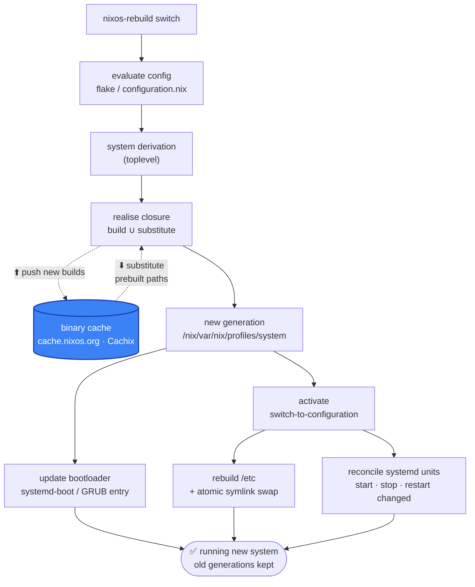

<SectionBookend image="/alice-daily-driving.png" title="Daily driving" subtitle="living on Nix: dev shells, direnv, rebuilds" />

---

# Anatomy of a flake <span class="text-2xl">❄️</span>

> A flake is just an attrset with two keys

```nix
{
  inputs = {                                 # what this flake depends on
    nixpkgs.url      = "github:NixOS/nixpkgs/nixos-unstable";
    home-manager.url = "github:nix-community/home-manager";
  };

  outputs = { self, nixpkgs, ... }: {        # a function → what it produces
    packages.x86_64-linux.default  = …;      #  → nix build
    devShells.x86_64-linux.default = …;      #  → nix develop
    nixosConfigurations.laptop     = …;      #  → nixos-rebuild switch
  };
}
```

- **`inputs`** — other flakes, each pinned in `flake.lock` to an exact git rev + hash
- **`outputs`** — a **function of the resolved inputs**, returning a well-known schema the CLI knows how to consume
- **Pure &amp; hermetic** — no ambient `<nixpkgs>`, no network mid-eval → the lock makes it reproducible anywhere
- **Field note:** a `flake.nix` in a GitHub repo is a reliable sign the maintainer is an extremely cool person 😎

---

# A reproducible dev shell

Drop a `flake.nix` in a repo and `nix develop` gives everyone the same toolchain:

```nix
{
  description = "dev shell";
  inputs.nixpkgs.url = "github:NixOS/nixpkgs/nixos-unstable";

  outputs = { self, nixpkgs }:
    let pkgs = import nixpkgs { system = "x86_64-linux"; };
    in {
      devShells.x86_64-linux.default = pkgs.mkShell {
        packages = [ pkgs.nodejs_24 pkgs.git ];
      };
    };
}
```

`nix develop` → you're in a shell with Node 24 and Git, pinned by the flake lock.

---

# `nix develop` — what actually happens

```bash
nix develop        # inside a repo with a flake.nix
```

<div class="text-left max-w-3xl mx-auto pt-4">

1. **Resolve** — lock the flake &amp; pick `devShells.<system>.default` out of its outputs
2. **Evaluate** — that devShell is itself a **derivation**: its `buildInputs`, environment variables, and `shellHook`
3. **Realise** — every tool in the shell (`nodejs_24`, `git`) + its full closure lands in `/nix/store` — built or substituted, exactly like `nix run`
4. **Enter** — Nix **recreates that build environment** (`PATH`, `$buildInputs`, hooks) and drops you into an interactive subshell

</div>

<div class="opacity-60 text-sm pt-4">You're standing <em>inside</em> a derivation's build environment — minus the sandbox. Exit and it's gone; the system <code>PATH</code> was never touched.</div>

---

# `direnv` — you don't even type it <span class="text-2xl">🚪</span>

<div class="grid grid-cols-2 gap-10 items-center mt-2">
<div>

One line in a repo's `.envrc`:

```bash
# .envrc
use flake
```

- `cd` **in** → the flake's devShell auto-loads · `cd` **out** → it unloads. Nothing leaks into your global shell.
- **nix-direnv** caches the evaluated shell → re-entry is **instant**, not a fresh flake eval every time
- Your editor &amp; terminal just _see_ the right `PATH`, env vars &amp; tools — per directory

</div>
<div>
<Placeholder label="cd into repo → tools appear · cd out → gone" />
</div>
</div>

<div class="opacity-60 text-sm pt-4">First visit: <code>direnv allow</code> to trust the file · <a href="https://direnv.net">direnv.net</a> · <a href="https://github.com/nix-community/nix-direnv">nix-direnv</a></div>

---

# `nixos-rebuild switch` — what actually happens

> One atomic step from config to running system

<div class="grid grid-cols-2 gap-8 items-center mt-2">
<div>



</div>
<div>

- **Evaluate → derivation** — the whole machine becomes one `system` derivation, hashed like any other build
- **Realise** — **substitute** unchanged paths straight from a binary cache 🔵, build only the delta, and **push** fresh builds back; nothing is live yet
- **New generation** — the result is registered as a fresh generation, right next to the old ones
- **Bootloader + activation** — add a boot entry, then `switch-to-configuration` swaps `/etc` and reconciles services **in place**

<div class="opacity-70 text-sm pt-2">Everything up to activation is side-effect-free — so a failed build changes <em>nothing</em>, and the previous generation is always one reboot away. ↩️</div>

</div>
</div>

<div class="opacity-60 text-sm pt-3"><code>boot</code> = same, minus activation (applies next reboot) · <code>test</code> = activate without a boot entry.</div>
