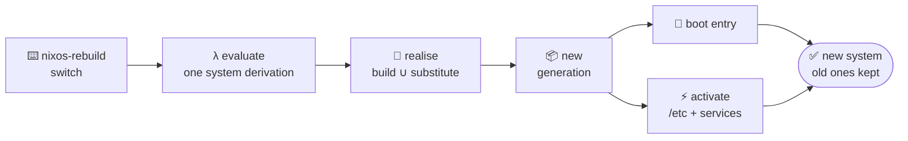

<div class="text-7xl pb-2">🎞️</div>

# The cutting floor

<div class="text-xl opacity-80 pt-2">bonus slides — the hands-on tour, in still form</div>

---

# Getting Nix <span class="text-2xl">⬇️</span>

Two ways in — same language, same store, same commands:

<div class="grid grid-cols-2 gap-8 pt-6">
<div>

### 🐧 standalone
On **any Linux**, macOS, or WSL — one installer, no reboot:

```bash
curl -fsSL https://install.determinate.systems/nix \
  | sh -s -- install
```

</div>
<div>

### 💻 NixOS
The **whole OS** is Nix — config to bootloader. More on that in a moment.

</div>
</div>

<div class="opacity-60 text-sm pt-8">Try it on the machine you already have — going full NixOS is the deep end, not the entry fee.</div>

<!--
The installer is Determinate Systems' — the de-facto standard now: creates the /nix APFS volume on macOS, survives OS upgrades, has a real uninstaller, flakes on by default.

On macOS there's also **nix-darwin** worth mentioning aloud: the NixOS module system ported to the Mac — packages, launchd services, `defaults`-style settings, all declarative with generations and `darwin-rebuild switch`. It layers *on top of* this standalone install (the installer answers "how do I get Nix", nix-darwin answers "how do I make my Mac declarative"). It gets its own slide in the ecosystem section.
-->

---

# The everyday toolbox <span class="text-2xl">🧰</span>

> A handful of verbs cover most of daily Nix

<div class="grid grid-cols-2 gap-10 mt-2">
<div>

### 🏃 Ephemeral — try it, then it's gone

```bash
nix run   nixpkgs#hello      # run once, no install
nix shell nixpkgs#cowsay     # tools on PATH (subshell)
nix develop                  # enter a flake's devShell
nix search nixpkgs ripgrep   # find in 100k+ packages
```

</div>
<div>

### 📌 Persistent — sticks around

```bash
nix profile install nixpkgs#ripgrep
nix profile list | remove | rollback
nix build nixpkgs#hello      # → ./result symlink
nix flake init | update      # scaffold | bump lock
```

</div>
</div>

<div class="opacity-60 text-sm pt-4"><code>run</code>/<code>shell</code>/<code>develop</code> vanish when you exit · <code>profile</code> persists — with generations &amp; rollbacks, just like the system. Sweep up with <code>nix-collect-garbage -d</code>.</div>

---

# `nix profile` — installs that roll back too <span class="text-2xl">📌</span>

> Unlike `run` / `shell` / `develop`, this one **sticks around** — but it's still just symlinks &amp; generations

```bash
nix profile install nixpkgs#ripgrep   # add to your user profile
nix profile list                      # what's installed
nix profile rollback                  # undo the last change
```

<div class="grid grid-cols-2 gap-10 items-center mt-2">
<div>

- Your profile is a **generation-backed symlink tree** — `~/.nix-profile → /nix/store/…-profile`
- Every `install` / `remove` / `upgrade` mints a **new generation**; the old one stays for `rollback`
- Same model as `nixos-rebuild` — atomic &amp; reversible — but scoped to **one user**, no root needed
- Content-addressed underneath → two tools wanting different `glibc`s coexist happily

</div>
<div>
<Placeholder label="~/.nix-profile → one generation per change" />
</div>
</div>

<div class="opacity-60 text-sm pt-4">Ephemeral: <code>run</code> · <code>shell</code> · <code>develop</code> — vs — persistent &amp; rollback-able: <code>profile</code>.</div>

---

# The Nix language in 30 seconds

```nix
let
  pkgs = import <nixpkgs> {};
  greeting = name: "Hello, ${name}!";
in
{
  message = greeting "Nix";
  tools   = [ pkgs.git pkgs.jq pkgs.ripgrep ];
}
```

- **Attribute sets** (`{ ... }`) and **lists** (`[ ... ]`) are the building blocks
- Functions are `arg: body`, applied by juxtaposition: `greeting "Nix"`
- `let … in` binds names for the expression below; `${…}` interpolates into strings

<!--
The Meet Nix theory (expressions, not statements) in real syntax: the whole file is ONE expression whose value is the attrset at the bottom.
-->

---

# Batteries included — `builtins` <span class="text-2xl">🔋</span>

The language is tiny — the standard library is one global attrset:

```nix
builtins.length [ 1 2 3 ]                    # 3
builtins.map (x: x * 2) [ 1 2 3 ]            # [ 2 4 6 ]
builtins.readFile ./motd.txt                 # "hello, wonderland\n"
builtins.fromJSON ''{ "port": 443 }''        # { port = 443; }
builtins.fetchGit { url = "…"; rev = "…"; }  # a pinned source, as a value
```

- ~100 functions — strings, lists, attrsets, paths, JSON/TOML — no imports needed
- Even I/O stays honest: what `readFile` / `fetchGit` return **becomes part of the inputs** the build is hashed on
- `builtins.derivation` is the primitive underneath it all — everything else is sugar over it

<div class="opacity-60 text-sm pt-4">Day to day you'll mostly use the richer layer on top: <code>nixpkgs.lib</code> (<code>lib.mkIf</code>, <code>lib.mapAttrs</code>, …).</div>

<!--
The language itself has almost no keywords — everything lives in the `builtins` attrset, always in scope, no imports. Roughly a hundred functions.

The interesting ones are the impure-looking ones: `readFile`, `fetchGit`, `getEnv`. They don't break purity because whatever they return is captured as an *input* to evaluation — read a file and its content is part of what gets hashed; fetch a repo and (in flakes) it must be pinned to a rev. The escape hatches are all accounted for.

`builtins.derivation` is the ur-primitive: literally every package — all 100k in nixpkgs — bottoms out in calls to it. `mkDerivation`, `mkShell`, buildRustPackage… all sugar.

nixpkgs.lib is the community stdlib layered on top — that's where the module system helpers (mkIf, mkForce, mapAttrs) live. builtins = the language's; lib = nixpkgs's.
-->

---

# Anatomy of a flake <span class="text-2xl">❄️</span>

> A flake is just an attrset with two keys

```nix
{
  inputs = {                                 # what this flake depends on
    nixpkgs.url      = "github:NixOS/nixpkgs/nixos-unstable";
    home-manager.url = "github:nix-community/home-manager";
  };

  outputs = { self, nixpkgs, ... }: {        # a function → what it produces
    packages.x86_64-linux.default  = …;      #  → nix build
    devShells.x86_64-linux.default = …;      #  → nix develop
    nixosConfigurations.laptop     = …;      #  → nixos-rebuild switch
  };
}
```

- **`inputs`** — other flakes, each pinned in `flake.lock` to an exact git rev + hash
- **`outputs`** — a **function of the resolved inputs**, returning a well-known schema the CLI knows how to consume
- **Pure &amp; hermetic** — no ambient `<nixpkgs>`, no network mid-eval → the lock makes it reproducible anywhere
- **Field note:** a `flake.nix` in a GitHub repo is a reliable sign the maintainer is an extremely cool person 😎

---

# A reproducible dev shell

Drop a `flake.nix` in a repo and `nix develop` gives everyone the same toolchain:

```nix
{
  description = "dev shell";
  inputs.nixpkgs.url = "github:NixOS/nixpkgs/nixos-unstable";

  outputs = { self, nixpkgs }:
    let pkgs = import nixpkgs { system = "x86_64-linux"; };
    in {
      devShells.x86_64-linux.default = pkgs.mkShell {
        packages = [ pkgs.nodejs_24 pkgs.git ];
      };
    };
}
```

`nix develop` → you're in a shell with Node 24 and Git, pinned by the flake lock.

---

# `direnv` — you don't even type it <span class="text-2xl">🚪</span>

<div class="grid grid-cols-2 gap-10 items-center mt-2">
<div>

One line in a repo's `.envrc`:

```bash
# .envrc
use flake
```

- `cd` **in** → the flake's devShell auto-loads · `cd` **out** → it unloads. Nothing leaks into your global shell.
- **nix-direnv** caches the evaluated shell → re-entry is **instant**, not a fresh flake eval every time
- Your editor &amp; terminal just _see_ the right `PATH`, env vars &amp; tools — per directory

</div>
<div>
<Placeholder label="cd into repo → tools appear · cd out → gone" />
</div>
</div>

<div class="opacity-60 text-sm pt-4">First visit: <code>direnv allow</code> to trust the file · <a href="https://direnv.net">direnv.net</a> · <a href="https://github.com/nix-community/nix-direnv">nix-direnv</a></div>

---

# `nixos-rebuild switch` — what actually happens

<div class="flex justify-center items-center h-[380px]">



</div>

<div class="text-center opacity-70">the <b>same pipeline</b> from "under the hood" — the "package" is your <b>entire machine</b> · nothing mutates until activation</div>

<!--
The whole machine goes through the exact evaluate → realise → store → share pipeline from the "under the hood" section, as ONE derivation.

- **Evaluate** — the whole config becomes one `system` derivation (toplevel), hashed like any other build
- **Realise** — substitute unchanged paths from a binary cache, build only the delta; nothing is live yet
- **New generation** — registered in /nix/var/nix/profiles/system, right next to the old ones
- **Boot entry + activation** — systemd-boot/GRUB entry added, then `switch-to-configuration` swaps /etc atomically and starts/stops/restarts only the changed systemd units

Everything before activation is side-effect-free — a failed build changes *nothing*, and the previous generation is always one reboot away.

Variants: `boot` = same, minus activation (applies next reboot) · `test` = activate without a boot entry.
-->
