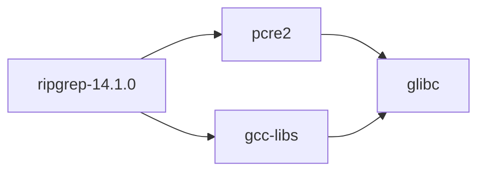
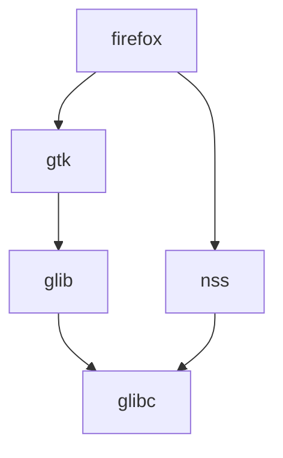
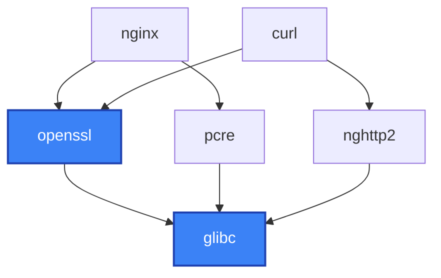
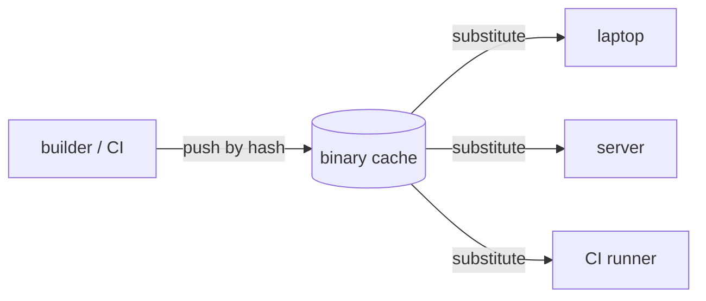
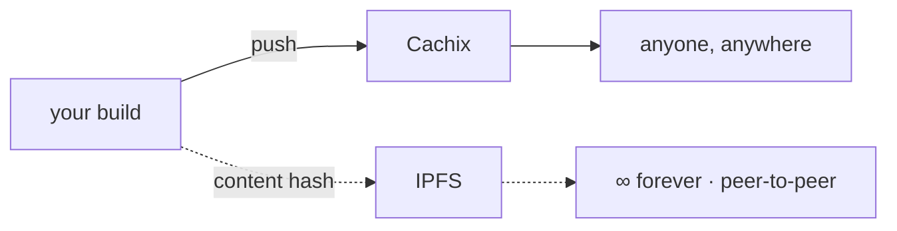

# I ❤️ NixOS

and you should too

---

# Quick temperature check <span class="text-2xl">🌡️</span>

<div class="opacity-70 pb-4">Where's the room at with Nix? Pick one:</div>

- **A** — Never heard of it / "Nix… what?"
- **B** — Heard the hype, never touched it
- **C** — Dabbled — ran `nix-shell`, maybe broke my system once
- **D** — Daily driver / it's running on this laptop right now

<div class="text-sm opacity-50 pt-6">📊 <b>[insert poll]</b> — live poll placeholder (Slido / Mentimeter / show of hands)</div>

---
layout: center
class: text-center
---

<div class="absolute inset-0" style="background: #000 url(/alice-rabbit-hole.png) center / cover no-repeat;"></div>

<div class="absolute bottom-10 left-0 right-0 text-white text-4xl font-bold tracking-wide" style="text-shadow: 0 2px 12px rgba(0,0,0,0.8)">
  Down the rabbit hole
</div>

---

# First steps <span class="text-2xl">🐇</span>

> _"Down, down, down. Would the fall never come to an end?"_

The thing that first made me _want_ Nix — a tiny, stupid annoyance:

- **Pop!\_OS COSMIC** has no way to turn off desktop animations — [`cosmic-comp` #376](https://github.com/pop-os/cosmic-comp/issues/376) is still an open request. The durations are **baked into the compositor source**.
- **My world:** patch the source, rebuild `cosmic-comp`… then do it **again after every update**. Forever.
- **A friend on NixOS:** a ~10-line **overlay** carrying the same patch — declared once, re-applied automatically on every rebuild. It just _stays_ fixed.

<div class="opacity-60 text-sm pt-4">Same patch. One of us re-did it weekly; the other wrote it down once. → the <b>Overlays vs patches</b> story, later.</div>

---

# …so you write it down once

```nix
# configuration.nix — an overlay that re-patches cosmic-comp on every build
nixpkgs.overlays = [
  (final: prev: {
    cosmic-comp = prev.cosmic-comp.overrideAttrs (old: {
      postPatch = ''
        ${old.postPatch or ""}

        # set every animation duration to 1ms
        find src/shell -type f -name "*.rs" -exec sed -i \
          's/Duration::from_millis([0-9]\+)/Duration::from_millis(1)/g' {} \;
      '';
    });
  })
];
```

<div class="opacity-60 text-sm pt-2">Declared once · re-applied on every rebuild &amp; update · <a href="https://github.com/pop-os/cosmic-comp/issues/376#issuecomment-3851990669">cosmic-comp #376</a></div>

---

# Wait — what does "nix" even mean? <span class="text-2xl">❄️</span>

> _"Why, sometimes I've believed as many as six impossible things before breakfast."_

<div class="grid grid-cols-3 gap-8 pt-6">
<div>

### ❄️ Latin — _nix_
**snow.** `nix, nivis`. That's the **snowflake** logo — every build a unique, perfect crystal.

</div>
<div>

### 🚫 Dutch/German — _niks_
**nothing.** No hidden state, nothing implicit, nothing shared — a build depends on _nothing_ you didn't declare.

</div>
<div>

### ✂️ English — _to nix_
**cancel · veto · kill.** As in: _nix_ dependency hell, _nix_ "works on my machine."

</div>
</div>

<div class="opacity-60 text-sm pt-8">One little word, three promises — and all three turn out to be true.</div>

---

# …and "Nix" means three things at once <span class="text-2xl">🃏</span>

> _"Who are YOU?" said the Caterpillar._

<div class="grid grid-cols-3 gap-8 pt-6">
<div>

### 🗣️ the language
A lazy, purely-functional DSL. You **write** Nix to describe what you want built.

</div>
<div>

### 📦 the package manager
The tool that **evaluates** that language, builds derivations, and owns the `/nix/store`. Runs on any Linux, macOS, WSL.

</div>
<div>

### 💻 the OS — NixOS
A whole **Linux distro** where the language configures the _entire_ system, not just packages.

</div>
</div>

<div class="opacity-60 text-sm pt-8">Same three letters, three layers — language → package manager → OS. We'll take them in that order.</div>

---

# The Nix language in 30 seconds

```nix
let
  pkgs = import <nixpkgs> {};
  greeting = name: "Hello, ${name}!";
in
{
  message = greeting "Nix";
  tools   = [ pkgs.git pkgs.jq pkgs.ripgrep ];
}
```

- Everything is an **expression** — there are no statements
- **Attribute sets** (`{ ... }`) and **lists** (`[ ... ]`) are the building blocks
- Functions are `arg: body`, applied by juxtaposition: `greeting "Nix"`
- Evaluation is **lazy** — nothing computes until something needs it

---

# What makes the language unique

- **Purely functional** — no mutation, no side effects; a build is a function of its inputs alone
- **Lazy** — nothing evaluates until it's needed, so a 100k-package set stays cheap to work with
- **Domain-specific** — the whole language exists to describe one thing: **derivations** (build recipes)
- **Hermetic & content-addressed** — the same expression always resolves to the same `/nix/store` path
- The payoff: configuration is **code you can compose, override, and reason about** — not a pile of shell scripts

---

# A brief history <span class="text-2xl">📜</span>

- **2003** — Eelco Dolstra starts Nix as PhD research → thesis _"The Purely Functional Software Deployment Model"_ (2006)
- **2007** — **NixOS** is born: a whole Linux distro driven by Nix, out of Armijn Hemel's master's thesis
- **2010s** — **nixpkgs** grows into one of the largest package collections in existence
- **2020–21** — **flakes** arrive (experimental): pinned inputs + lockfiles for the whole ecosystem
- **today** — stewarded by the NixOS Foundation & companies like Determinate Systems; among the largest _and_ freshest repos anywhere

---

# Nix vs NixOS

<div class="grid grid-cols-2 gap-10 mt-2">
<div>

### Nix
- The **language** + **package manager**
- Runs on any Linux, macOS, even WSL
- Gives you dev shells, reproducible builds, the `/nix/store`
- **nixpkgs** = the package collection it draws from

</div>
<div>

### NixOS
- A full **Linux distribution** built on Nix
- The **whole system** is one declarative config
- Generations, rollbacks, services — all from `.nix` files
- Needs Nix; the reverse isn't true

</div>
</div>

<div class="opacity-60 text-sm pt-4">Nix is the engine 🔧 · NixOS is the car built around it 🚗</div>

---

# Where it all lives: `/nix/store`

```text
/nix/store/a3f9k2q…z1-ripgrep-14.1.0
           └──── hash ────┘└ name-ver ┘
```

- The **hash** is of _every_ build input — sources, deps, flags, compiler; **name-version** is just a label
- Each path is **immutable** & self-contained → many versions coexist, zero conflicts



<div class="opacity-60 text-sm">Each path records the store paths it references → an exact dependency <b>DAG</b>. Change one input → new hash → everything above it rebuilds.</div>

---

# The shape of everything: a **DAG**

A **Directed Acyclic Graph** — the structure the whole `/nix/store` forms.

- **Directed** — every edge points one way: _A needs B_
- **Acyclic** — no cycles; nothing can depend on itself, even through a long chain
- ⇒ a valid **build order** always exists — sort it topologically, build the leaves first



<div class="opacity-60 text-sm">Why Nix leans on it: exact dependency <b>closures</b> (just follow the arrows) · <b>parallel</b> builds of independent branches · safe <b>garbage collection</b> — nothing points at it ⇒ deletable. A cycle would mean "build A before A"; the store simply can't contain one.</div>

---

# Shared graphs → build it once

Different packages overlap deep down. The shared subgraph (in **blue**) is **one** set of store paths.



- `nginx` and `curl` overlap on `openssl → glibc` — that subgraph is built **once**, stored **once**, cached **once**
- Installing another `openssl`-based tool builds only its **unique** nodes; the rest is already in the store (or a cache hit)
- ⇒ you pay for the **delta**, not the whole tree — the secret behind fast rebuilds & installs

---

# Caching across machines

A store path's name **is** the hash of its inputs — so every machine agrees on what a build _should_ be.



- Build once on a beefy **remote builder** or CI box → **copy** the result anywhere; the hash proves it's the right artifact
- Everyone else **substitutes** (downloads) instead of rebuilding — no trust in the _builder_ needed, only the hash
- This works **only because** paths are content/input-addressed — the hash is the shared key

---

# …and cache the whole planet <span class="text-2xl">🌍</span>



- **Cachix** — a hosted binary cache: push once, and the whole community can substitute your builds (public caches serve millions of paths)
- You never trust the _server_ — you trust the **hash** + signatures; content-addressing makes worldwide sharing safe
- **IPFS** — Nix paths are _already_ content-addressed, so they map straight onto a content-addressed network → share builds **peer-to-peer, forever**, with no single point of failure

---

# Why people love it <span class="text-2xl">❤️</span>

Seven reasons — we'll take them one at a time.

<Stepper :current="0" />

---

# Instant rollbacks

<Stepper :current="1" />

<div class="grid grid-cols-2 gap-10 items-center mt-2">
<div>

Every rebuild is a new **generation**. Booted something broken? Pick the previous one from the boot menu — nothing was mutated in place.

</div>
<div>
<Placeholder label="boot menu listing NixOS generations" />
</div>
</div>

---

# Reproducibility

<Stepper :current="2" />

<div class="grid grid-cols-2 gap-10 items-center mt-2">
<div>

Same inputs → the same output, **bit for bit**. Your laptop, a CI runner, a teammate's machine — identical results.

</div>
<div>
<Placeholder label="identical build artifacts on different machines" />
</div>
</div>

---

# Build caching

<Stepper :current="3" />

<div class="grid grid-cols-2 gap-10 items-center mt-2">
<div>

Reproducible outputs are **shareable**. If someone already built this exact derivation, fetch the prebuilt binary from a cache (`cache.nixos.org`, or your own) instead of compiling it.

</div>
<div>
<Placeholder label="binary cache hit vs local build" />
</div>
</div>

---

# Declarative systems

<Stepper :current="4" />

<div class="grid grid-cols-2 gap-10 items-center mt-2">
<div>

Your whole machine in one config. No snowflake servers, no config drift — the system **is** the code.

</div>
<div>
<Placeholder label="configuration.nix → the whole desktop" />
</div>
</div>

---

<PbjTime />

---
layout: center
class: text-center
---

<div class="text-7xl pb-2">🎬</div>

# Demo time

<div class="text-xl opacity-80 pt-2">Claude Code vibe-codes a NixOS config — live, against a fresh VM</div>

<div class="inline-block mt-8 text-sm font-bold px-3 py-1 rounded-full bg-red-500 text-white animate-pulse">● LIVE — switch to the VM</div>

---

# nixpkgs

<Stepper :current="5" />

<div class="grid grid-cols-2 gap-10 items-center mt-2">
<div>

The largest **and** freshest package set anywhere — 100k+ packages, updated fast.

</div>
<div>
<Placeholder label="package-count / freshness chart" />
</div>
</div>

---

# No dependency hell

<Stepper :current="6" />

<div class="grid grid-cols-2 gap-10 items-center mt-2">
<div>

Every version coexists, isolated by **content hash**. Two apps needing two different `glibc`s? Both happy.

</div>
<div>
<Placeholder label="two apps, two isolated dependency trees" />
</div>
</div>

---

# Flakes

<Stepper :current="7" />

<div class="grid grid-cols-2 gap-10 items-center mt-2">
<div>

Pinned, lockfile-backed inputs. A `flake.lock` makes the build **fully deterministic** and shareable.

</div>
<div>
<Placeholder label="flake.nix + flake.lock" />
</div>
</div>

---

# nixos-anywhere

<Stepper :current="8" />

<div class="grid grid-cols-2 gap-10 items-center mt-2">
<div>

Deploy a declarative NixOS config to **any** remote box — bare metal or a fresh cloud VM — in one command.

</div>
<div>
<Placeholder label="laptop deploying a config to a remote server" />
</div>
</div>

---

# Why people reach for it

- **Reproducibility** — a build that works today works the same on another machine, next year
- **No "works on my machine"** — dependencies are pinned by content hash, not by whatever `apt` happened to install
- **Atomic upgrades & rollbacks** — switch generations forward or back instantly; nothing is mutated in place
- **Per-project dev shells** — drop into an environment with exactly the tools a repo needs, and nothing leaks out

---

# A reproducible dev shell

Drop a `flake.nix` in a repo and `nix develop` gives everyone the same toolchain:

```nix
{
  description = "dev shell";
  inputs.nixpkgs.url = "github:NixOS/nixpkgs/nixos-unstable";

  outputs = { self, nixpkgs }:
    let pkgs = import nixpkgs { system = "x86_64-linux"; };
    in {
      devShells.x86_64-linux.default = pkgs.mkShell {
        packages = [ pkgs.nodejs_24 pkgs.git ];
      };
    };
}
```

`nix develop` → you're in a shell with Node 24 and Git, pinned by the flake lock.

---
layout: center
class: text-center
---

# NixMaxxing <span class="text-3xl">💪</span>

<div class="opacity-80 text-xl pt-2">when "it works" isn't enough — declare <em>everything</em></div>

<div class="grid grid-cols-2 gap-x-10 gap-y-2 text-left max-w-2xl mx-auto pt-8">
<div>🏠 dotfiles → <b>Home Manager</b></div>
<div>🍎 your Mac → <b>nix-darwin</b></div>
<div>🔐 secrets → <b>sops-nix / agenix</b></div>
<div>🌐 the whole fleet → <b>clan.lol</b></div>
<div>💾 disks → <b>disko</b></div>
<div>🚀 any remote box → <b>nixos-anywhere</b></div>
</div>

<div class="opacity-60 text-sm pt-8">no config left behind 🐇 — now let's go deeper…</div>

---
layout: center
class: text-center
---

# Curiouser and curiouser…

<div class="opacity-70 text-xl pt-2">deeper down the hole — the parts still under construction</div>

<div class="pt-6 text-sm opacity-50">🐇 the following are <b>TODO</b> placeholders</div>

---

# `nix-ld` — running foreign binaries <span class="text-xs font-bold px-2 py-1 rounded bg-amber-400 text-black align-middle">🚧 TODO</span>

> _"Who in the world am I?"_ — binaries that expect an ordinary `/lib`

- Pre-built dynamic executables can't find `ld.so` / their libs on NixOS
- `nix-ld` = shim loader + `NIX_LD_LIBRARY_PATH` to satisfy them
- **Hint:** this is the trick for getting **Claude Code** (and similar tooling) to run on NixOS

---

# Overlays vs patches <span class="text-xs font-bold px-2 py-1 rounded bg-amber-400 text-black align-middle">🚧 TODO</span>

> _Painting the roses_ — change a package without forking the world

- **Overlay:** override / extend a package in the package set
- **Patch:** modify source before the build (`patches = [ … ]`)
- **Case study:** the "Tempest" fix — write up overlay-vs-patch trade-off

---

# Two doors, one store <span class="text-xs font-bold px-2 py-1 rounded bg-amber-400 text-black align-middle">🚧 TODO</span>

> Input-addressed vs **content-addressed** derivations

- **IA:** path = hash of _inputs_ (recipe) → known _before_ building
- **CA:** path = hash of _output content_ → known only _after_ building
- Both coexist in the same `/nix/store` and the same dependency graph
- **Hint:** the bridge between them is a record called a **realisation**

---

# Realisations & mixed graphs <span class="text-xs font-bold px-2 py-1 rounded bg-amber-400 text-black align-middle">🚧 TODO</span>

- CA outputs carry **realisation** records: `(drv-output-id → path, signatures)`
- **IA → CA** works via **placeholder strings** rewritten to the real path at build time
- **Substitution:** IA = pure path lookup · CA = "realise drv X" round trip first
- **Trust:** independent builders agreeing on a content hash = evidence of reproducibility

---

# Perfect refactors → the same hash <span class="text-xs font-bold px-2 py-1 rounded bg-amber-400 text-black align-middle">🚧 TODO</span>

> The Cheshire grin — same output even when the recipe changed

- **IA pain:** a comment change in `glibc` → invalidated hash → _the whole world rebuilds_
- **CA payoff:** bit-identical output → same content hash → dependents reuse cache (**early cutoff**)
- **Status:** `ca-derivations` still experimental; nixpkgs is overwhelmingly IA today

---
layout: center
class: text-center
---

# The ecosystem 🌍

<div class="opacity-70 text-xl pt-2">a few projects worth knowing</div>

---

# Home Manager

<div class="grid grid-cols-2 gap-10 items-center mt-2">
<div>

Declarative **dotfiles &amp; user environment** — the layer you reach for right after NixOS itself.

- Your shell, editor, git config, packages — all in `.nix`
- Per-user **generations &amp; rollbacks**, just like the system
- Works standalone, or as a NixOS / nix-darwin module

</div>
<div>
<Placeholder label="Home Manager — dotfiles as code" />
</div>
</div>

<div class="opacity-60 text-sm pt-4"><a href="https://github.com/nix-community/home-manager">github.com/nix-community/home-manager</a></div>

---

# nix-darwin

<div class="grid grid-cols-2 gap-10 items-center mt-2">
<div>

NixOS-style **declarative config for macOS** — your Mac described in one repo, the same way.

- Manage system settings, packages, and `defaults` declaratively
- Pairs with **Home Manager** for your user environment
- Same Nix workflow across Linux and macOS

</div>
<div>
<Placeholder label="nix-darwin — declarative macOS config" />
</div>
</div>

<div class="opacity-60 text-sm pt-4"><a href="https://github.com/nix-darwin/nix-darwin">github.com/nix-darwin/nix-darwin</a></div>

---

# Dev environments

<div class="grid grid-cols-2 gap-10 items-center mt-2">
<div>

Per-project toolchains, friendlier than raw `nix develop`:

- **devenv** — languages, services (Postgres, Redis…), processes & scripts
- **devbox** — package-manager UX; you barely touch Nix
- **direnv + nix-direnv** — the shell **auto-activates** the moment you `cd` in

</div>
<div>
<Placeholder label="cd into a repo → the right tools just appear" />
</div>
</div>

<div class="opacity-60 text-sm pt-4"><a href="https://devenv.sh">devenv.sh</a> · <a href="https://www.jetify.com/devbox/">devbox</a> · <a href="https://github.com/nix-community/nix-direnv">nix-direnv</a></div>

---

# clan.lol

<div class="grid grid-cols-2 gap-10 items-center mt-2">
<div>

Declarative **fleet management** built on NixOS — manage a whole network of machines from one repo.

- Zero-config peer-to-peer networking between machines
- Built-in **secrets** management
- One command to deploy and update the fleet

</div>
<div>
<Placeholder label="clan.lol — one repo managing many machines" />
</div>
</div>

<div class="opacity-60 text-sm pt-4"><a href="https://clan.lol">clan.lol</a></div>

---

# Cachix

<div class="grid grid-cols-2 gap-10 items-center mt-2">
<div>

Hosted **binary cache** for Nix — never compile the same thing twice.

- Push build artifacts once, pull them everywhere (laptops, CI, teammates)
- Turns slow first builds into fast cache hits
- The standard answer to "why is it building from source?"

</div>
<div>
<Placeholder label="cachix push/pull — build once, share everywhere" />
</div>
</div>

<div class="opacity-60 text-sm pt-4"><a href="https://cachix.org">cachix.org</a></div>

---

# Secrets

<div class="grid grid-cols-2 gap-10 items-center mt-2">
<div>

"Where do passwords go in a config you commit to git?" — encrypted, decrypted at activation into tmpfs.

- **agenix** — age-based, one file per secret; simplest to start
- **sops-nix** — SOPS-based, scales to many secrets &amp; backends (age, KMS, PGP)
- Secrets never land in the world-readable `/nix/store`

</div>
<div>
<Placeholder label="encrypted secret → /run/secrets at activation" />
</div>
</div>

<div class="opacity-60 text-sm pt-4"><a href="https://github.com/ryantm/agenix">agenix</a> · <a href="https://github.com/Mic92/sops-nix">sops-nix</a></div>

---

# Discovery &amp; ergonomics

<div class="grid grid-cols-2 gap-10 items-center mt-2">
<div>

The tools that make daily Nix pleasant:

- **search.nixos.org** — find any package or NixOS option
- **comma (`,`)** — run any program without installing it: `, cowsay hi`
- **nh** — nicer `rebuild` / `switch` with pretty diffs &amp; smarter GC

</div>
<div>
<Placeholder label="search.nixos.org + , + nh" />
</div>
</div>

<div class="opacity-60 text-sm pt-4"><a href="https://search.nixos.org">search.nixos.org</a> · <a href="https://github.com/nix-community/comma">comma</a> · <a href="https://github.com/nix-community/nh">nh</a></div>

---

# Editing Nix

<div class="grid grid-cols-2 gap-10 items-center mt-2">
<div>

Make Nix feel like a real language in your editor:

- **LSP** — `nixd` or `nil` for completion, goto-def, option hints
- **Formatter** — `nixfmt` (the official standard); `alejandra` a popular alternative
- **Linters** — `statix` (anti-patterns) + `deadnix` (dead code), usually wired via `treefmt-nix`

</div>
<div>
<Placeholder label="editor with Nix LSP + format-on-save" />
</div>
</div>

<div class="opacity-60 text-sm pt-4"><a href="https://github.com/nix-community/nixd">nixd</a> · <a href="https://github.com/oxalica/nil">nil</a> · <a href="https://github.com/NixOS/nixfmt">nixfmt</a> · <a href="https://github.com/oppiliappan/statix">statix</a> · <a href="https://github.com/astro/deadnix">deadnix</a></div>

---

# Erase your darlings <span class="text-2xl">🔥</span>

<div class="grid grid-cols-2 gap-10 items-center mt-2">
<div>

**impermanence** — wipe `/` on every boot, keep only what you _declared_.

- Root lives on tmpfs (or a rolled-back snapshot); reboot = clean slate
- Persist only the dirs/files you explicitly list
- Hidden state can't accumulate — if it's not declared, it's gone

</div>
<div>
<Placeholder label="reboot → root wiped → only declared state survives" />
</div>
</div>

<div class="opacity-60 text-sm pt-4"><a href="https://github.com/nix-community/impermanence">github.com/nix-community/impermanence</a> · <a href="https://grahamc.com/blog/erase-your-darlings/">grahamc.com — Erase your darlings</a></div>

---

# NixCon

<div class="grid grid-cols-2 gap-10 items-center mt-2">
<div>

The community **conference** for Nix &amp; NixOS — talks, workshops, and the people behind the project.

- Where the roadmap and big ideas get hashed out
- Talks recorded and posted online if you can't attend
- The best way to meet the community in person

</div>
<div>
<Placeholder label="NixCon — community conference" />
</div>
</div>

<div class="opacity-60 text-sm pt-4"><a href="https://nixcon.org">nixcon.org</a></div>

---
layout: center
class: text-center
---

# Where to go next

[nix.dev](https://nix.dev) · [Zero to Nix](https://zero-to-nix.com) · [nixos.org](https://nixos.org)

Thanks!
